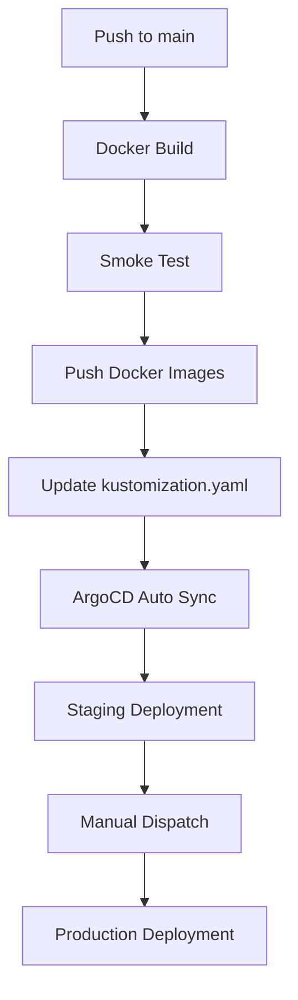

# 🗒️ Django Note App Deployment with GitOps (ArgoCD + EKS)

This project demonstrates a complete **GitOps-based** deployment workflow for a Django Notes application. We use **GitHub Actions** for automation and **ArgoCD** for continuous deployment into an **Amazon EKS** cluster. Infrastructure is managed using **Kustomize** for environment-specific manifests.

---

## 🚀 Tech Stack

| Tool | Purpose |
|------|---------|
| **Django** | Backend framework |
| **MySQL** | Database |
| **Nginx** | Reverse proxy |
| **Docker** | Containerization |
| **GitHub Actions** | Workflow automation |
| **Kustomize** | Kubernetes overlay management |
| **ArgoCD** | GitOps-based deployment |
| **Amazon EKS** | Kubernetes cluster |

---

## 📁 Project Structure

```
.
├── Dockerfile                   # Django backend
├── nginx/Dockerfile            # Nginx reverse proxy
├── docker-compose.yml          # Local dev stack
├── requirements.txt            # Python deps
├── noteapp-kustomize/          # Kustomize base and overlays
│   ├── base/
│   └── overlays/{staging,production}/
├── argocd/
│   ├── app-staging.yaml
│   └── app-production.yaml
└── .github/workflows/
    └── noteapp-gitops-pipelines.yml
```

---

## 🔁 Workflow Automation (via GitHub Actions)

### 🔄 Triggered On:
- Push to `main` (deploys to **staging** environment)
- Manual `workflow_dispatch` (triggers **production** deployment)

---

### 🧱 Workflow Job Summary


#### 1️⃣ `docker-build`
- Builds `noteapp-backend` and `noteapp-nginx` Docker images
- Saves them as artifacts

#### 2️⃣ `smoke-test`
- Loads Docker images
- Spins up app using `docker-compose` (MySQL + Django + Nginx)
- Verifies availability using `curl`

📦 **Output**:
```
MySQL is healthy!
Django is healthy!
Running smoke test...
Smoke test passed!
```

#### 3️⃣ `docker-push`
- Tags images using Git SHA
- Pushes them to DockerHub using secrets

#### 4️⃣ `update-kustomization`
- Updates image tags in `kustomization.yaml` using `yq`
- Commits changes back to repo

```bash
Updated image tags to abc1234 in kustomization.yaml
```

#### 5️⃣ `django-note-app-staging-deploy`
- Applies ArgoCD `app-staging.yaml` using `kubectl`
- ArgoCD auto-syncs changes in staging

📸 **Staging CLI Output**:  


#### 6️⃣ `django-note-app-production-deploy`
- Manual trigger deploys production ArgoCD manifest

📸 **Production CLI Output**:  


---

## 🌐 ArgoCD Dashboards


### 🔄 Staging App  


### 🔄 Production App  


---

## ✅ Final Application Output


---

## 🧪 Run Locally

```bash
git clone <repo-url>
cd <repo>
```

### 🔐 `.env` setup:
```bash
cat <<EOF > .env
DATABASE_HOST=db
DATABASE_NAME=test_db
DATABASE_USER=root
DATABASE_PASSWORD=root
DATABASE_PORT=3306
EOF
```

### 🐳 Start services:
```bash
docker-compose up -d
```

### 🌐 Access:
`http://localhost:80`

### 🧹 Stop services:
```bash
docker-compose down --volumes
```

---

## 🔐 GitHub Secrets Required

| Secret | Description |
|--------|-------------|
| `DOCKER_USERNAME` | DockerHub login |
| `DOCKER_PASS` | DockerHub password |
| `GIT_TOKEN` | Git commit access |
| `KUBECONFIG` | EKS cluster kubeconfig |

---

## 🔁 GitOps Workflow



---


